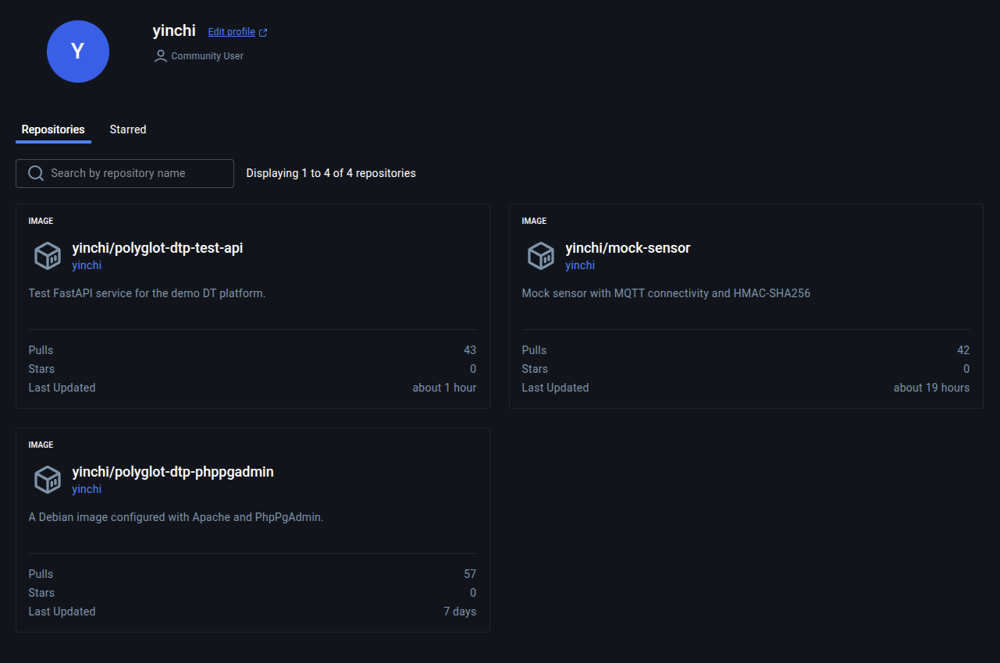
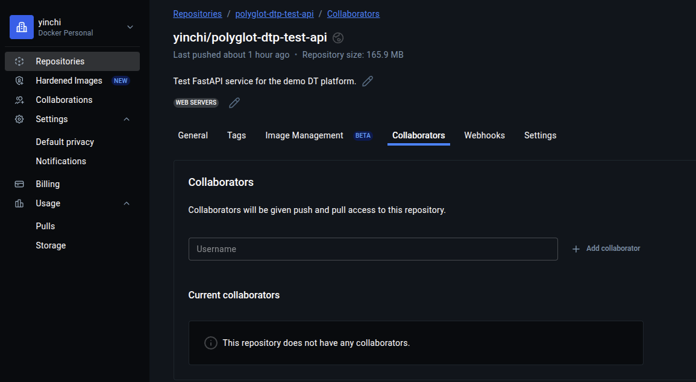

# Docker Compose

- The main Docker Compose file is `compose.yaml` in the root directory.
- Each service group (shared database, DT, etc.) is defined in a `compose.include.yaml` file.
  - The include file must be **manually** added to the `include` section of the main `compose.yaml` file!
- All networks should be defined in the main `compose.yaml` file, but volumes may be defined in an include file if only used by services in that specific group.
- Use `restart: always` to ensure critical services re-establish themselves after failure or shutdown.
- When writing our own services, use `:latest` tags during development but switch to fixed version tags once the codebase is stable.
- Be sure to update the metadata for container images uploaded (`docker push`) to GHCR.io or Docker Hub.

  

- Refer to the Docker section in the `justfile` for a list of useful command-line recipes.  In particular, `just docker-clean` can sometimes recover several GB of disk space.

## Push access on Docker Hub

Collaborators can be given push access to a repository on Docker Hub.

## Links

- [Compose file reference](https://docs.docker.com/reference/compose-file/)
- [Docker Hub](https://hub.docker.com/)
