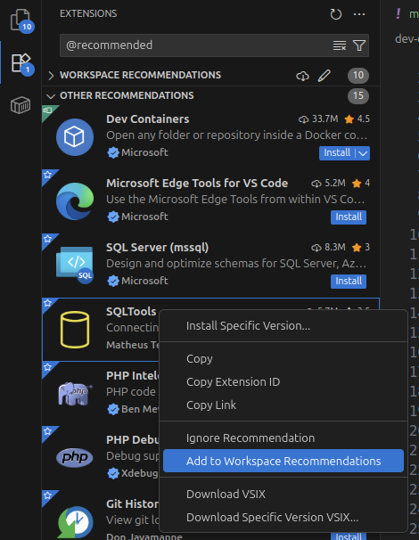
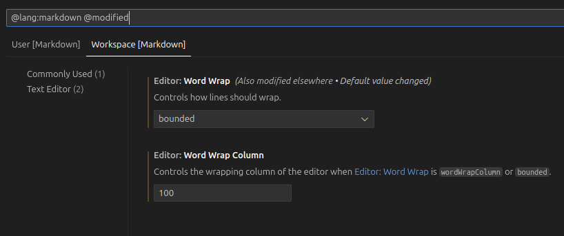

# VS Code Extensions and Settings

The `.vscode` folder in the DTP repository contains two files:

## `extensions.json`

`extensions.json` includes a list of recommended extensions for VS Code.

- To view the list of recommended extensions, use ++ctrl+shift+p++ to load the Command Palette in VS Code and choose "Extensions: Show Recommended Extensions".

    !!! note
        If you have changed your keybindings in VS Code, use those keyboard shortcuts instead.

- To add to the list of recommended extensions, right-click on the extension to add and select "Add to Workspace Recommendations".

For more on the `extensions.json` format, see [Microsoft's documentation](https://code.visualstudio.com/docs/configure/extensions/extension-marketplace#_workspace-recommended-extensions).

## `settings.json`

`settings.json` includes workspace-specific configuration settings for VS Code and installed extensions.  For a graphical settings interface, enter ++ctrl+comma++.

Language-specific settings can be shown using `@lang:` in the search bar.  To show only modified settings, use `@modified`.

### User versus workspace settings

Use user settings for settings you wish to apply across your personal VS Code setup, and workspace settings for settings you wish to apply for everyone working on a specific project.  For even more control, user settings and extensions can be scoped using [profiles](https://code.visualstudio.com/docs/configure/profiles).
