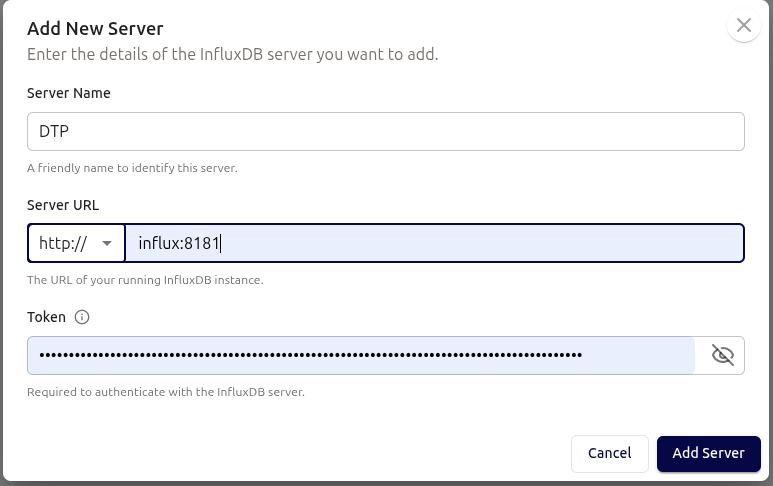

# InfluxDB configuration

## Before starting the service

Use `just influx-token` to create the admin password file.  This uses a temporary container to create the file; the final service container mounts this file to provide the initial admin token for the database.

## Using the service

We can access the InfluxDB command-line interface using `just influx`.  This executes the CLI using `docker compose exec`.

To initialize the database:
```bash
just influx create database dtp
just influx show databases
```

## Configuring the UI interface

Go to <http://influxui.localhost/configure/servers> and add a new server as follows:


For the token, use the `INFLUXDB3_AUTH_TOKEN` entry in `.env`.  Remember to update `.env` if the admin token is changed.

## Reference

- [InfluxDB3 CLI reference](https://docs.influxdata.com/influxdb3/enterprise/reference/cli/influxdb3/)
- [InfluxDB3 Python Client](https://pypi.org/project/influxdb3-python/)
